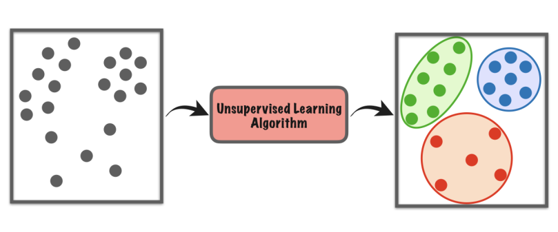
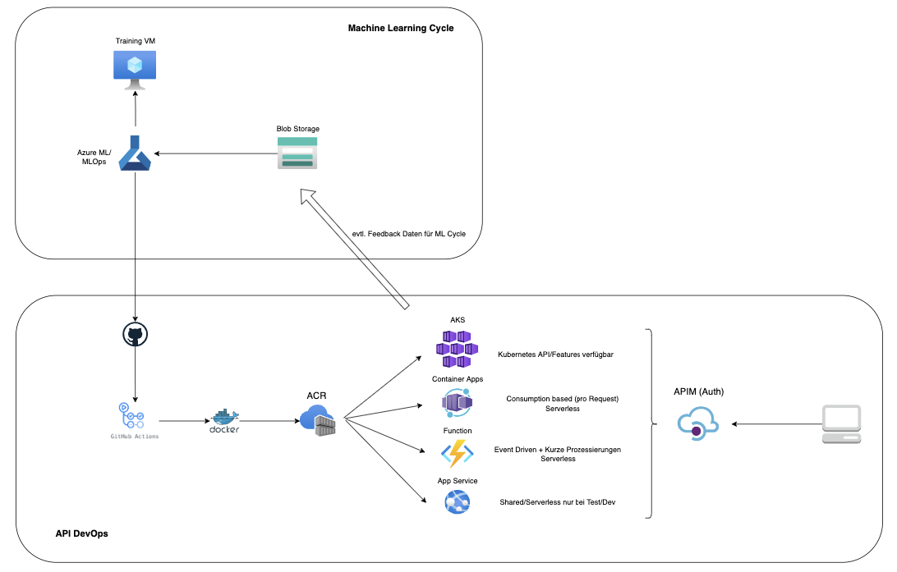

### **Classification API**

Swagger UI:
[localhost:8000/docs](localhost:8000/docs)

Test Endpoint:
[](localhost:8000/insta/classification)

```
curl -X 'POST' \
  'http://localhost:8000/insta/classification' \
   -H 'accept: application/json' \
   -H 'Content-Type: application/json' \
   -d '{ "textBody": "string" }'
```

### **Topics finden:**

1) Instagram Posts besitzen neben dem Bild zusätzlich noch **Hashtags**, die zur Suche und thematischen Einordnung herangezogen werden können. Hier könnte man die Häufigkeit der Hashtags und die Korrelation einzelner Hashtags analysieren.

Es macht Sinn, stark korrelierende Hashtags zu einen Topic zusammenzufassen, sowie die am häufigsten vorkommenden Hashtag auswählen. 

2) Für den Fall ohne Hashtags, kann man einen **unsupervised clustering Algorithmus** anwenden um Topics/Gruppierungen zu generieren. Das kann auch zusätzlich zu den Hashtags gemacht werden, um diese ggf. zu validieren oder erweitern. 



### Deployment auf Azure:

Für das deployment des Microservices auf Azure hat man im wesentlichen die Auswahl zwischen Azure Kubernetes Service, Container Apps, Azure Function und Azure App Service

\- AKS wäre geeignet, wenn die Infrastruktur im auch mit anderen Tools z.B. Prometheus/Grafana Monitoring auf Kubernetes liegt und man hier erweiterte Features von Kubernetes nutzen kann

\- Container Apps würde ich in diesem Fall mit wenig Kontext nutzen, da der Microservice serverless deployed werden kann und ein consumption based pricing model besitzt

\- Azure Function würde wie Container Apps als serverless option auch in Frage kommen, ist aber nicht auf Container ausgelegt und bietet insbesondere im Bezug auf die Größe Limitierungen. Bei kleinen ML Modellen aber machbar.

\- Azure App Service kann auch per Container deployed werden, bietet allerdings nur in der kleinen Test/Dev Version eine shared/serverless Option an

